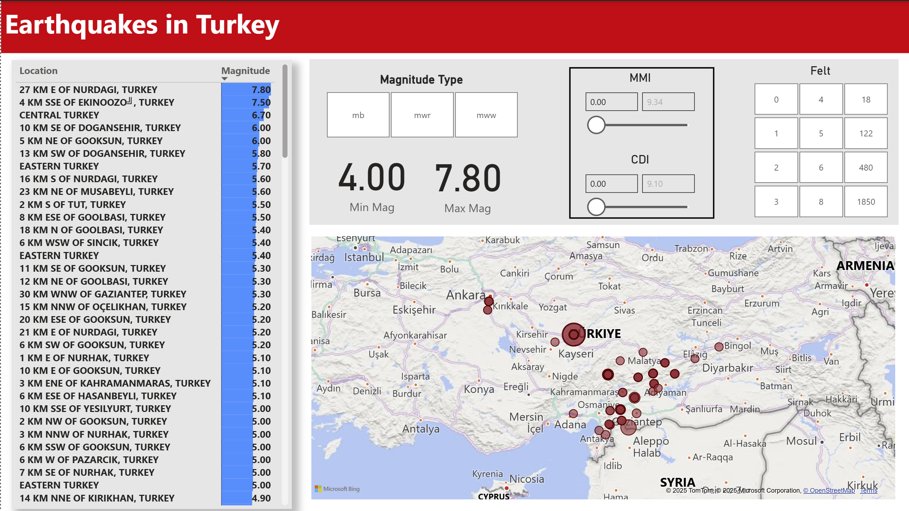
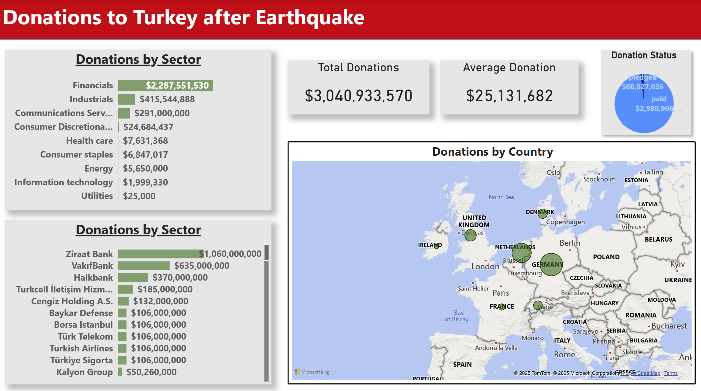
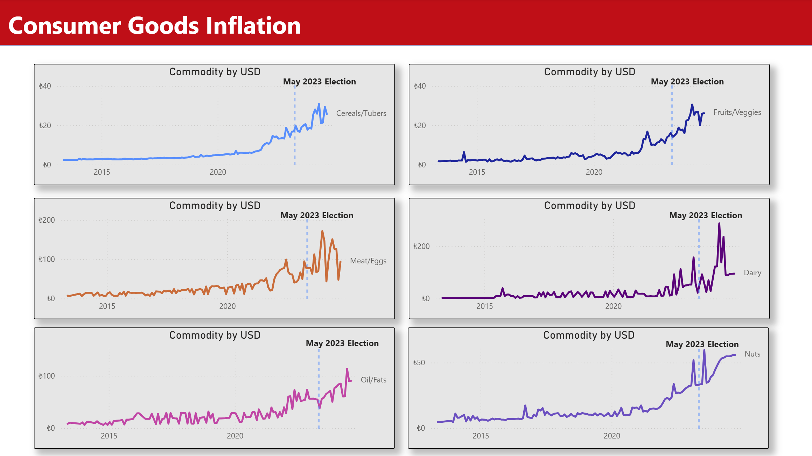
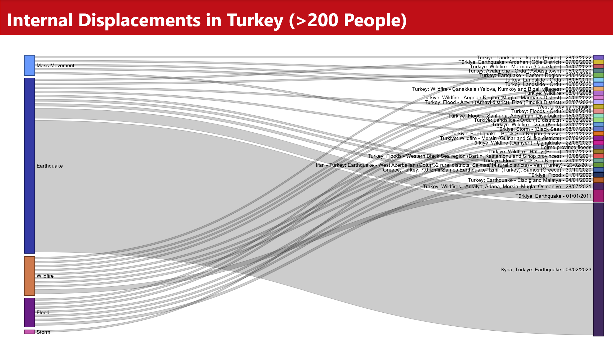

# 🇹🇷 Turkey Socioeconomic Dashboard

A multi-faceted Power BI dashboard visualizing recent socioeconomic trends in Turkey, including natural disasters, internal displacements, and inflationary pressures across sectors. Designed for policy analysts, humanitarian workers, and data-savvy citizens interested in Turkey's evolving landscape.

---

## 📊 Dashboard Overview

| Page | Visual | Description |
|------|--------|-------------|
| **Earthquakes in Turkey** |  | Interactive map of earthquakes by location and magnitude. Filterable by severity and date. |
| **Donations After Earthquake** |  | Visual summary of international and domestic donations by sector and country in response to the 2023 earthquake. |
| **Food Inflation by Commodity** |  | Longitudinal time series showing post-election commodity price trends in USD for key food categories. |
| **Internal Displacements** |  | Sankey chart showing major population displacements in Turkey by disaster type and event. |

---

## 📁 Files

- `Turkey_Socioeconomic.pbix`: Power BI report source file.
- `data/`: CSVs and cleaned datasets.
- `images/`: Static visuals used in README and media.

---

## 💡 Project Highlights

- 📍 **Geospatial Mapping** using Maps visuals in Power BI  
- 🌀 **Flow Visualization** with custom Sankey visuals  
- 📈 **Election-Sensitive Trends** in commodity pricing and inflation  
- 🌍 **Disaster Relief Tracking** by country and institution  

---

## 🚀 How to Use

1. Clone or download this repo.
2. Open `Turkey_Socioeconomic.pbix` in Power BI Desktop.
3. [Optional] Replace datasets with your own using Power Query.
4. Customize visuals or filters to fit your analysis goals.

---
